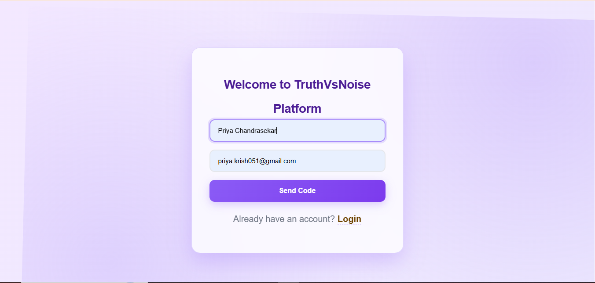
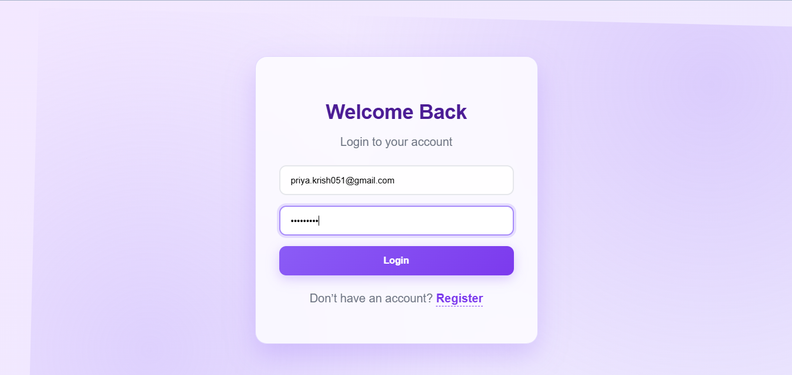
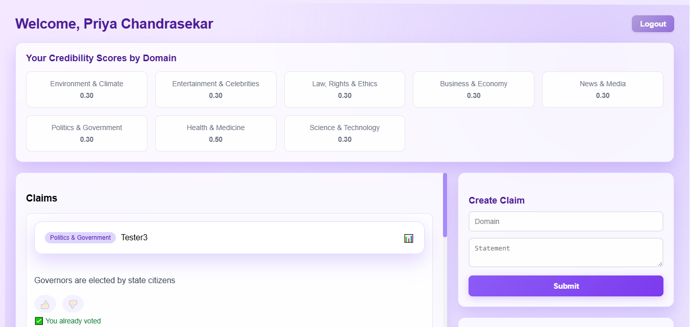
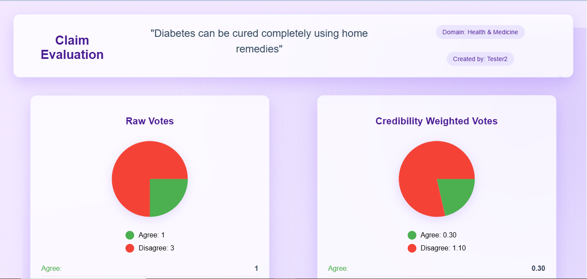
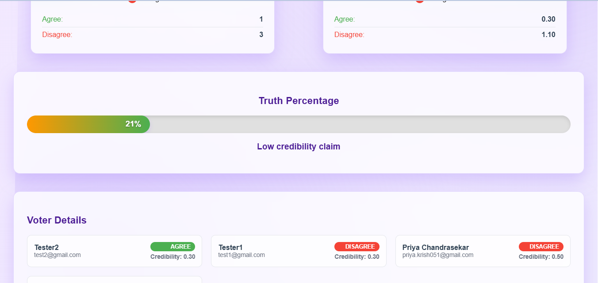
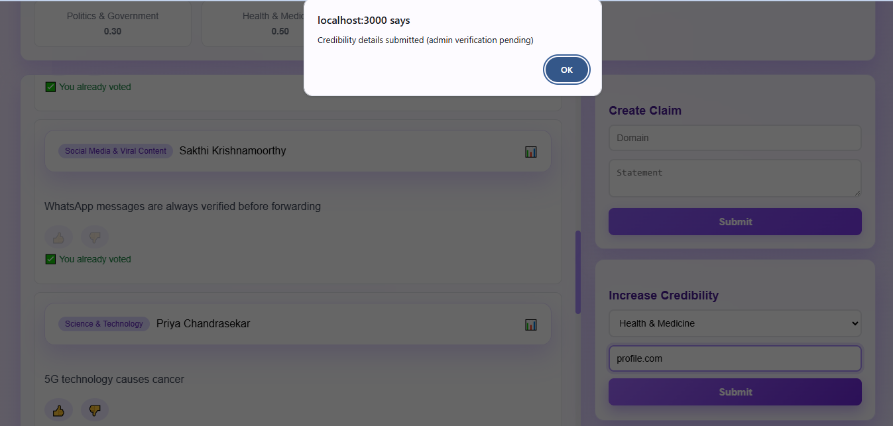
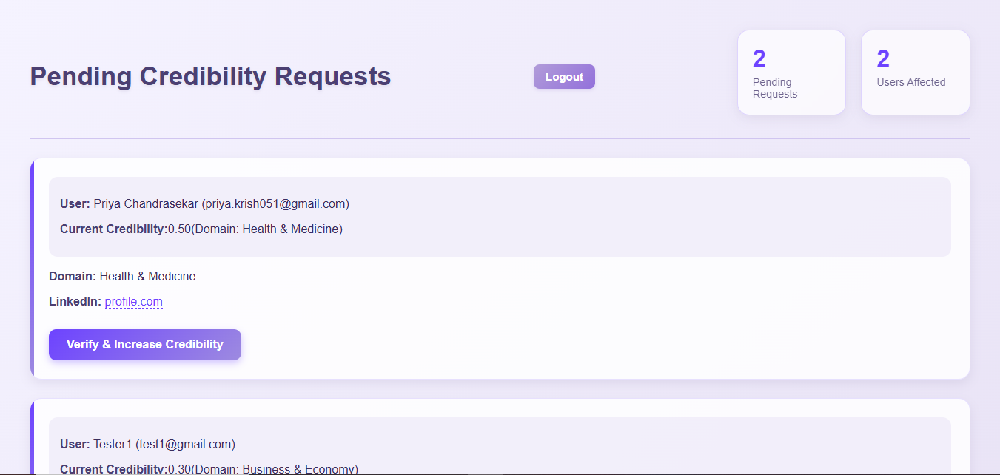

# Truth vs Noise - Fact Checking Platform

A full-stack web application for fact-checking claims and managing user credibility scores based on domain expertise.

## Table of Contents
- [Project Overview](#project-overview)
- [Features](#features)
- [Tech Stack](#tech-stack)
- [Project Structure](#project-structure)
- [Prerequisites](#prerequisites)
- [Setup Instructions](#setup-instructions)
- [API Endpoints](#api-endpoints)
- [Database Models](#database-models)
- [Application Workflow](#application-workflow)
- [Environment Variables](#environment-variables)
- [License](#license)

## Project Overview

Truth vs Noise is a platform that allows users to submit claims for fact-checking and evaluate the credibility of statements based on community voting. The platform incorporates a credibility scoring system where users with verified expertise in specific domains have more influence on the final evaluation of claims.

## Features

### User Authentication
- Email registration with OTP verification
- Secure login with JWT tokens
- Password encryption with bcrypt

### Claim Management
- Submit claims with domain categorization
- Community voting on claims (agree/disagree)
- Detailed claim evaluation with visual analytics

### Credibility System
- Domain-based credibility scoring
- LinkedIn profile verification for expertise validation
- Admin verification of user credibility requests

### Admin Panel
- Verify user LinkedIn profiles and expertise
- Manage user credibility scores
- Review pending user registrations

## Tech Stack

### Backend
- **Node.js** with Express.js
- **MongoDB** with Mongoose ODM
- **JWT** for authentication
- **Nodemailer** for email services
- **bcrypt.js** for password hashing

### Frontend
- **React** with hooks
- **React Router** for navigation
- **Material-UI** for UI components
- **Axios** for HTTP requests
- **TailwindCSS** for styling

## Project Structure

```
task/
├── backend/
│   ├── controllers/
│   │   ├── adminController.js
│   │   └── authController.js
│   ├── middleware/
│   │   ├── adminMiddleware.js
│   │   └── authMiddleware.js
│   ├── models/
│   │   ├── Claim.js
│   │   ├── Credibility.js
│   │   └── User.js
│   ├── routes/
│   │   ├── adminRoutes.js
│   │   ├── authRoutes.js
│   │   ├── claimRoutes.js
│   │   └── credibilityRoutes.js
│   ├── utils/
│   │   └── sendEmail.js
│   ├── .env
│   ├── initAdmin.js
│   ├── package.json
│   └── server.js
└── frontend/
    ├── public/
    ├── src/
    │   ├── components/
    │   │   └── Register/
    │   ├── pages/
    │   │   ├── Admin/
    │   │   ├── ClaimEvaluation/
    │   │   ├── Dashboard/
    │   │   └── Login/
    │   ├── utils/
    │   │   └── api.js
    │   ├── App.js
    │   └── index.js
    ├── package.json
    └── README.md
```

## Prerequisites

- Node.js (v14 or higher)
- MongoDB (local or cloud instance)
- npm or yarn package manager

## Setup Instructions

### Backend Setup

1. Navigate to the backend directory:
   ```bash
   cd backend
   ```

2. Install dependencies:
   ```bash
   npm install
   ```

3. Create a `.env` file in the backend directory with the following variables:
   ```env
   JWT_SECRET=your_jwt_secret_key
   MONGO_URI=mongodb://127.0.0.1:27017/truthvsnoise
   EMAIL_USER=your_email@gmail.com
   EMAIL_PASS=your_email_password
   ```

4. Start the server:
   ```bash
   npm start
   ```
   Or for development with auto-restart:
   ```bash
   npx nodemon
   ```

### Frontend Setup

1. Navigate to the frontend directory:
   ```bash
   cd frontend
   ```

2. Install dependencies:
   ```bash
   npm install
   ```

3. Start the development server:
   ```bash
   npm start
   ```

4. Build for production:
   ```bash
   npm run build
   ```

## API Endpoints

### Authentication
- `POST /api/auth/send-otp` - Send OTP to user email
- `POST /api/auth/verify` - Verify OTP and set password
- `POST /api/auth/login` - User login
- `GET /api/auth/me` - Get current user info
- `POST /api/auth/preferences` - Save user preferences

### Admin
- `GET /api/admin/pending-users` - Get users awaiting verification
- `POST /api/admin/verify-user/:id` - Verify a user
- `POST /api/admin/reject-user/:id` - Reject a user

### Claims
- `POST /api/claims` - Submit a new claim
- `GET /api/claims` - Get all claims
- `GET /api/claims/:id` - Get claim details
- `POST /api/claims/:id/vote` - Vote on a claim

### Credibility
- `POST /api/credibility` - Submit credibility request
- `GET /api/credibility` - Get all pending credibility requests (admin)
- `POST /api/credibility/:id/verify` - Verify credibility request (admin)

## Database Models

### User Model
- `name`: String
- `email`: String (unique)
- `password`: String (hashed)
- `role`: String (user/admin)
- `verified`: Boolean
- `otp`: String
- `domains`: Array of Strings
- `linkedin`: String
- `linkedinVerified`: Boolean
- `credibilityScore`: Array of Numbers (one for each domain)

### Claim Model
- `user`: ObjectId (User)
- `domain`: String
- `statement`: String
- `votes`: Array of vote objects
- `createdAt`: Date

### Credibility Model
- `user`: ObjectId (User)
- `knowledgeDomain`: String
- `linkedin`: String
- `verified`: Boolean
- `createdAt`: Date

## Application Workflow

### User Registration
1. User enters name and email on registration page
2. System sends OTP to email
3. User enters OTP and sets password
4. Account is verified and activated

### User Dashboard
1. View existing claims with domain categorization
2. Submit new claims with domain and statement
3. Vote on existing claims (agree/disagree)
4. Submit credibility requests with domain expertise and LinkedIn profile

### Claim Evaluation
1. Click on claim to view detailed evaluation
2. See raw votes vs. credibility-weighted votes
3. View overall truth percentage based on weighted votes
4. See individual voter details with credibility scores

### Admin Panel
1. Review pending credibility requests
2. Verify LinkedIn profiles and domain expertise
3. Approve requests to increase user credibility scores

### Credibility Scoring
1. Users start with base credibility score (0.3) in all domains
2. Submitting LinkedIn profile and domain expertise for verification
3. Admin approval increases credibility score by 0.2 (max 1.0)
4. Higher credibility scores carry more weight in claim evaluations

## Environment Variables

### Backend (.env)
```env
JWT_SECRET=your_jwt_secret_key_here
MONGO_URI=mongodb://127.0.0.1:27017/truthvsnoise
EMAIL_USER=your_gmail_address@gmail.com
EMAIL_PASS=your_gmail_app_password
NODE_ENV=development
PORT=5000
```
## Demo








## Initialize Admin User

Run the following command to create an initial admin user:
```bash
npm run init-admin
```

## License


This project is licensed under the MIT License.


